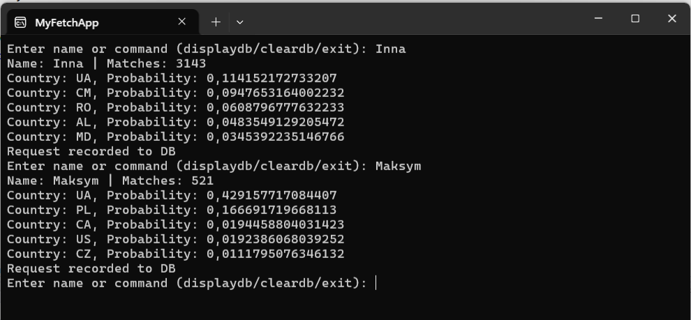
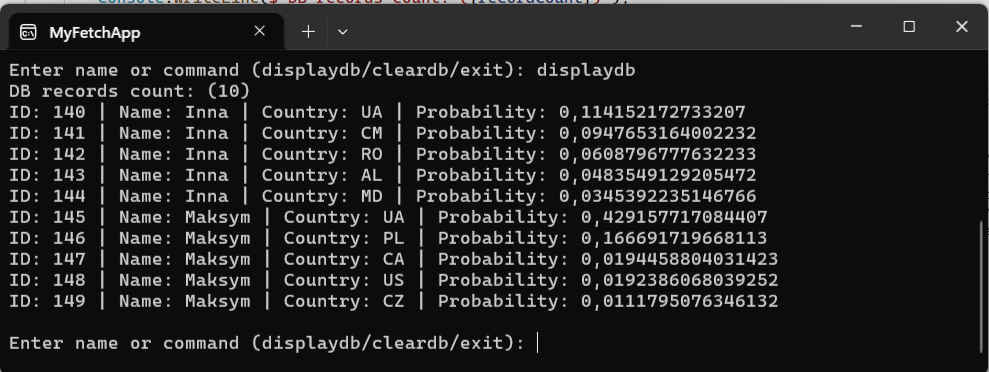
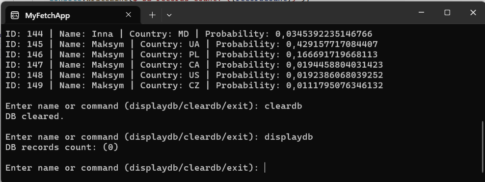

# API_Fetch_CSharp

Характеристики прогарми:
1. Консольна програма на C#, яка робить запити по визначеному API і отримує відповідь
2. Користувач може вводити випадкові імена, і отримувати відповіді по API від https://api.nationalize.io?name=nathaniel
3. Після API-запиту програма відображає в консолі отриману відповідь, а також записує її в базу даних
4. По текстовій команді "displaydb" програма виводить всі записи що є в Базі даних
5. По текстовій команді "cleardb" програма очищує Базу даних
6. По текстовій команді "exit" програма завершує роботу (БД очищається)

Результати роботи програми:

